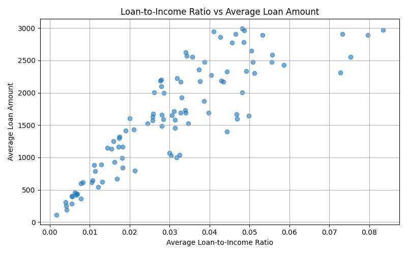
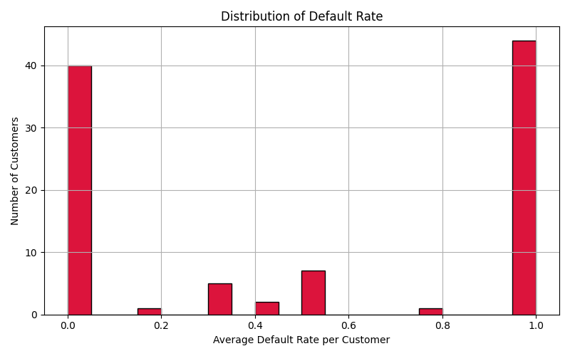
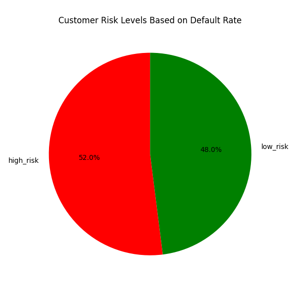
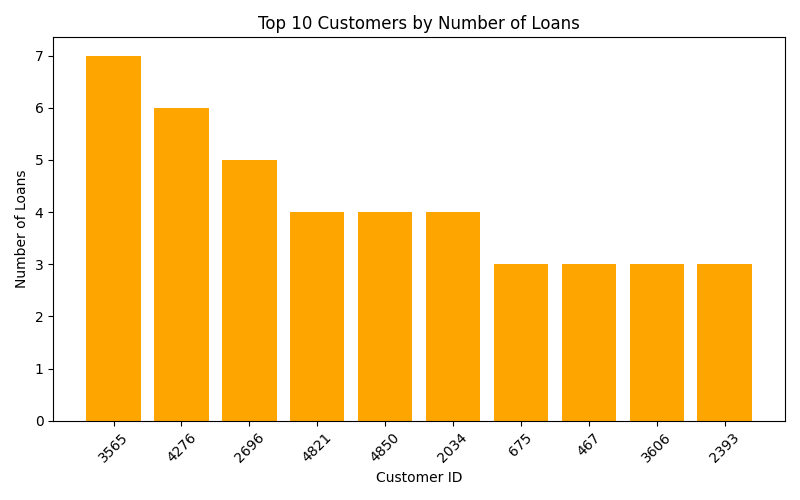
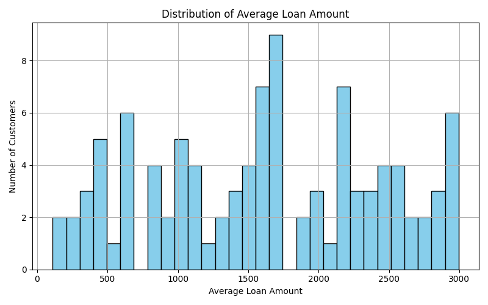
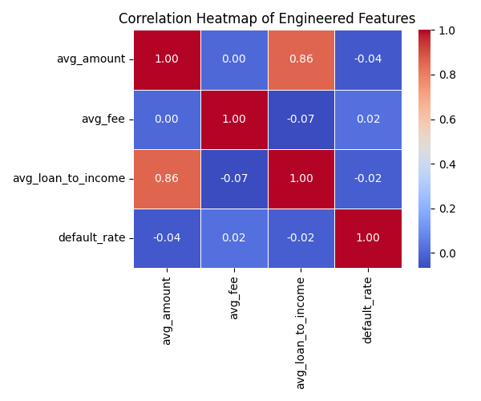

# 🚀 Feature Engineering with PySpark (Simplified Spark-in-a-Container Setup)

## 🧠 Problem Statement

Imagine you work for a loan company, and you have transactional data from customers. You want to **engineer features** like:
- How many loans a customer has taken
- Their average loan size
- Their default rate
- Their loan-to-income ratio

These features will help you understand **customer behavior** and **predict risk**.

But... your data is large, and you don’t want to do everything on Excel or slow scripts.

---

## 🧑‍🍳 Analogy: Cooking with Containers

Think of this project like **baking cookies in a portable kitchen**:

- 📝 The **PySpark script** is your recipe
- 🍚 The **CSV file** is your raw ingredients
- 🍳 The **Docker container** is your portable kitchen (has Python + Spark)
- 🏗️ The **Dockerfile** is your blueprint to build the kitchen
- 🎯 The **Parquet output** is your baked cookies (ready for ML or analysis)

---

## 📦 Technologies Used

- [x] Python + PySpark
- [x] Docker (single-container Spark environment)
- [x] Pandas, Matplotlib, Seaborn
- [x] Parquet format for optimized output

---

## 📁 Folder Structure

```
feature-engineering-pyspark/
│
├── Dockerfile                 # Builds Spark + Python container
├── docker-compose.yml         # Runs the container
├── spark-app/
│   └── feature_engineering.py # PySpark job (loads, engineers, saves data)
├── data/
│   └── cvas_data.csv          # Raw input data
│   └── loan_features/         # Output folder with Parquet files
├── visualize_features.py      # Python script to visualize output
└── assets/                    # Folder with visualization images
```

---

## ⚙️ Setup Instructions

### ✅ Step 1: Clone and Install Dependencies

```bash
git clone https://github.com/My-projects-portfolio/feature-engineering-pyspark.git
cd feature-engineering-pyspark
```

### ✅ Step 2: Place Your Dataset

Put your `cvas_data.csv` into the `/data/` folder. It should have columns like:

```
customer_ID,loan_date,amount,fee,loan_status,term,annual_income
124,23/06/2021,785,173,0,short,69246
...
```

---

### ✅ Step 3: Run the Spark Job

```bash
docker compose up --build
```

This will:
- Build the container with Spark and Python
- Run the `feature_engineering.py` script inside the container
- Save output to `data/loan_features/` in Parquet format

---

## 🔍 What the PySpark Script Does

```python
df = spark.read.csv("cvas_data.csv")
df = df.withColumn("loan_to_income", col("amount") / col("annual_income"))
agg_df = df.groupBy("customer_ID").agg(
    count("*").alias("num_loans"),
    avg("amount").alias("avg_amount"),
    ...
)
agg_df.write.parquet("loan_features")
```

➡️ It groups by each customer and creates features like:
- `num_loans`
- `avg_amount`
- `default_rate`
- `avg_loan_to_income`

---

## 📊 Visualizing the Results

Run this to visualize insights:

```bash
python visualize_features.py
```

### 📈 Example Plots:

#### 1. Loan-to-Income vs Loan Amount


#### 2. Default Rate Distribution


#### 3. Risk Segmentation


#### 4. Top 10 Customers by Loan Count


#### 5. Histogram of Average Loan Amount


#### 6. Correlation Heatmap


---

## 🎯 Learning Outcomes

- Run PySpark jobs inside Docker containers
- Engineer features at scale
- Output in Parquet format for downstream ML
- Visualize customer patterns and segment risk

---

## 🔧 Optional Extensions

- Train a model to predict `default_rate`
- Export high-risk customers for review
- Upload to Databricks or use with MLflow

---

## 📬 Contact

Built with ❤️ by [Your Name]  
Feel free to connect on [LinkedIn](https://linkedin.com/in/yourprofile) or [email](mailto:you@example.com)
